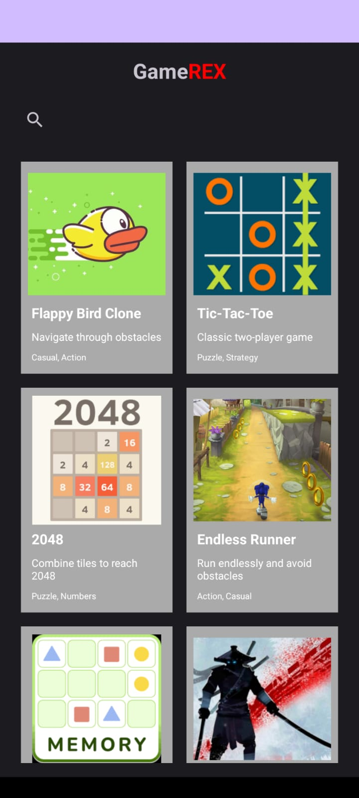
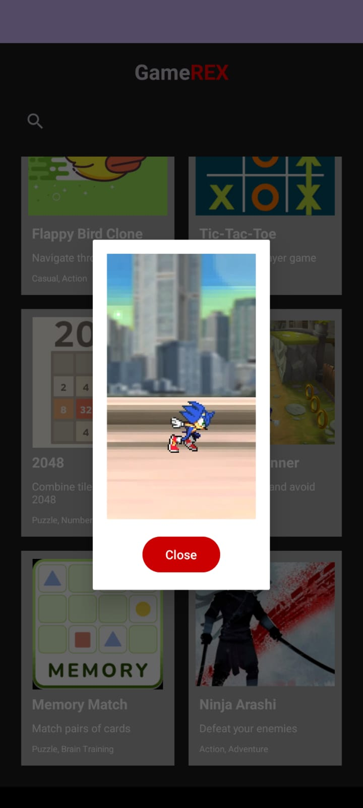
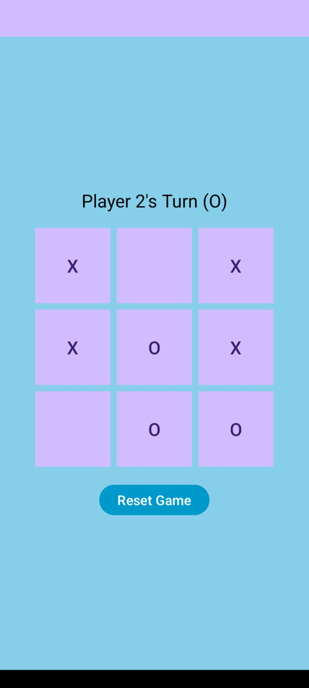

# Game Recommendation App

An Android app that recommends games and allows users to play them instantly. The app features a collection of popular games, including Flappy Bird, Tic-Tac-Toe, 2048, Endless Runner, and Memory Match. Users can search for games, view previews, and play them directly within the app.

## Features
- **Game Recommendations**: Browse a curated list of games with descriptions and tags.
- **Instant Play**: Play games like Tic-Tac-Toe and 2048 directly within the app.
- **Search and Filter**: Easily search for games by name or filter by category (e.g., Puzzle, Action).
- **Preview Videos**: Watch preview videos for games like Endless Runner before playing.
- **Responsive UI**: Clean and intuitive user interface designed for a seamless experience.

## Screenshots
| Home Screen | Game Preview | Gameplay |
|-------------|--------------|----------|
|  |  |  |

## Technologies Used
- **Android Studio**: Primary IDE for development.
- **Java**: Programming language for app logic.
- **RecyclerView**: For displaying the list of games.
- **VideoView**: For playing game preview videos.
- **Intent**: For opening external links (e.g., Memory Match game).
